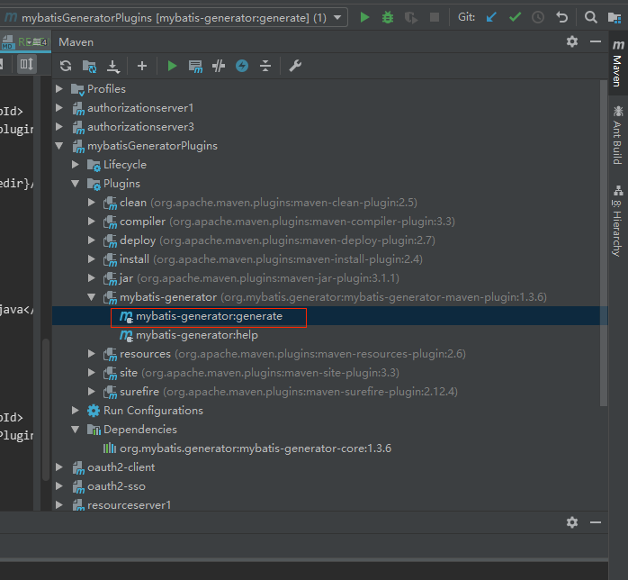

# 注意:
##  1.mysql驱动版本问题

##  2.乱码问题，（我的解决方案：设置mvn编译的编码）

    （1.改用下面的插件，2.再添加一些汉字，查询变化--一定要加）
    <plugin>
        <groupId>org.apache.maven.plugins</groupId>
        <artifactId>maven-compiler-plugin</artifactId>
        <version>3.3</version>
        <configuration>
            <encoding>UTF-8</encoding>
        </configuration>
    </plugin>

##  3.mybatis generate 连接数据库会使用全部的库
    
    在连接串中加入nullCatalogMeansCurrent=true就行了（参照我的配置）

#   使用方法：
    
    1.下载本maven项目
    2.安装到本地 ：mvn install
    3.再需要的工程里添加插件
        <plugin>
                <groupId>org.mybatis.generator</groupId>
                <artifactId>mybatis-generator-maven-plugin</artifactId>
                <version>1.3.6</version>
                <configuration>
                    <configurationFile>${project.basedir}/src/main/resources/generatorConfig.xml</configurationFile>
                    <verbose>true</verbose>
                    <overwrite>true</overwrite>
                </configuration>
                <dependencies>
                    <dependency>
                        <groupId>mysql</groupId>
                        <artifactId>mysql-connector-java</artifactId>
                        <!--
                        <version>5.1.47</version>-->
                        <version>8.0.13</version>
                    </dependency>
                    <dependency>
                        <groupId>com.zhou.test</groupId>
                        <artifactId>mybatisGeneratorPlugins</artifactId>
                        <version>1.0</version>
                    </dependency>
                </dependencies>
            </plugin>
     4.把 generatorConfig.xml拷贝到你的项目里
        4.1修改输出文件直接到你的项目里
        4.2修改生成文件的后缀
     5.运行mvn 插件 
